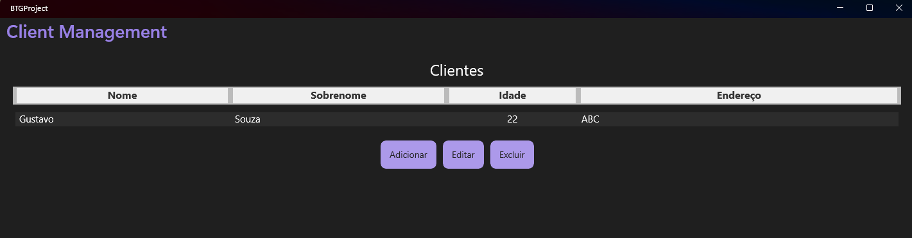
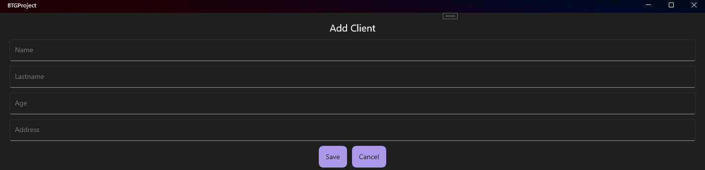
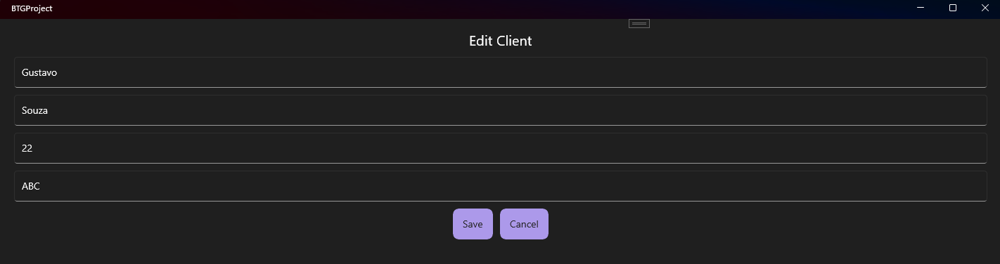

# BTGProject

Aplicação de gerenciamento de clientes desenvolvida em .NET MAUI (.NET 9), seguindo boas práticas de arquitetura, MVVM, injeção de dependência, persistência local e testabilidade.

---

## Sumário

- [Visão Geral](#visão-geral)
- [Funcionalidades](#funcionalidades)
- [Arquitetura e Organização](#arquitetura-e-organização)
- [Configuração e Execução](#configuração-e-execução)
- [Testes Automatizados](#testes-automatizados)
- [Imagens da Aplicação](#imagens-da-aplicação)
- [Diferenciais Técnicos](#diferenciais-técnicos)

---

## Visão Geral

O **BTGProject** é uma aplicação CRUD de clientes, multiplataforma, persistência local de dados e arquitetura desacoplada.  
O objetivo é demonstrar domínio de .NET MAUI, MVVM, injeção de dependência, testes unitários e boas práticas de desenvolvimento.

---

## Funcionalidades

- Listagem de clientes com visualização em tabela.
- Adição, edição e exclusão de clientes.
- Validação de campos obrigatórios e idade.
- Persistência local dos dados (JSON).
- Interface responsiva e amigável.
- Feedback visual para seleção e ações.
- Testes unitários para ViewModels e lógica de negócio.

---

## Arquitetura e Organização

O projeto está dividido em três camadas principais:
/BTGProject.Core    # Lógica de negócio, ViewModels, Models, Services, AppSettings
/BTGProject    # Projeto MAUI (UI, Views, Pages, Resources, Converters, DI)
/TestProject    # Testes unitários (xUnit, Moq)


### Principais componentes

- **MVVM:** Separação clara entre UI (Views/Pages) e lógica (ViewModels).
- **Injeção de dependência:** Todos os serviços, ViewModels e páginas são registrados e resolvidos via DI.
- **Persistência:** Os dados dos clientes são salvos e carregados automaticamente em arquivo JSON local.
- **Testabilidade:** Lógica desacoplada da UI, facilitando testes unitários.

---

## Configuração e Execução

### Pré-requisitos

- [.NET 9 SDK](https://dotnet.microsoft.com/download)
- Visual Studio 2022 (com workload MAUI)
- (Opcional) Emulador Android/iOS ou Windows 10+ para rodar o app

### Passos

1. **Clone o repositório:**
- git clone [https://github.com/GustaBS2003/Teste-Tecnico-BTG-Pactual-](https://github.com/GustaBS2003/Teste-Tecnico-BTG-Pactual-.git)

2. **Restaure os pacotes:**
- dotnet restore

3. **Compile a solução:**
- dotnet build
  
4. **Execute a aplicação:**
   - Pelo Visual Studio: selecione o projeto `BTGProject` e execute (F5).
   - Ou via terminal:
     ```bash
     dotnet build BTGProject/BTGProject.csproj
     dotnet run --project BTGProject/BTGProject.csproj
     ```

5. **A aplicação irá carregar a lista de clientes persistida (ou vazia, se for a primeira execução).**

---

## Testes Automatizados

Os testes unitários estão no projeto `TestProject` e cobrem as principais regras de negócio das ViewModels.

Para rodar os testes:
- dotnet test TestProject/TestProject.csproj

---

## Imagens da Aplicação

### Tela principal (listagem de clientes)


### Tela de adicionar cliente


### Tela de editar cliente


---

## Diferenciais Técnicos

- **.NET MAUI (.NET 9)**
- **MVVM com CommunityToolkit.Mvvm**
- **Injeção de dependência nativa**
- **Persistência local (JSON)**
- **Testes unitários com xUnit e Moq**
- **Código limpo, comentado e organizado**

--- 
